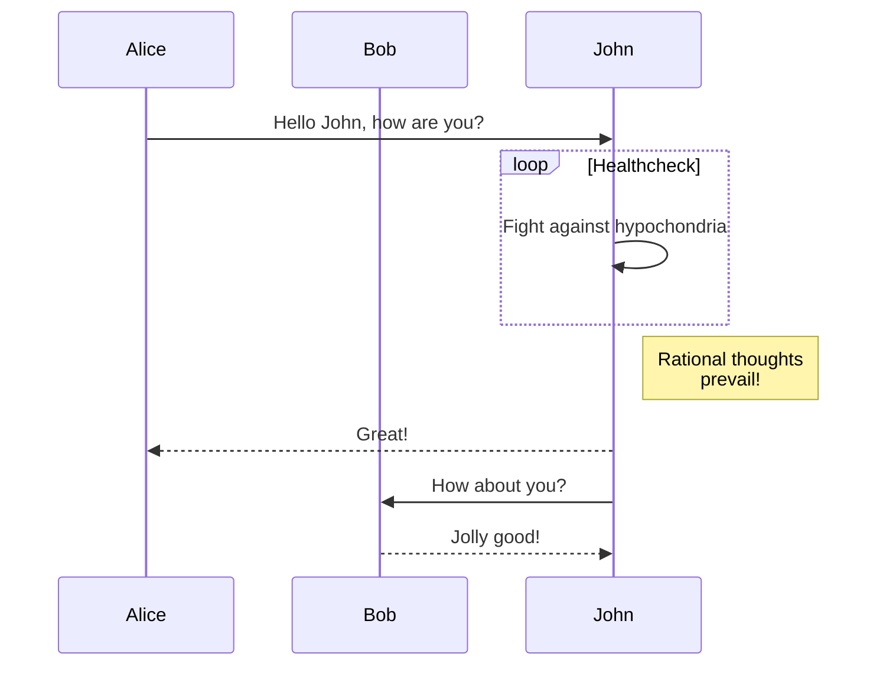

+++
title = "Shortcodes"
date = "2022-10-20"
description = "The Kita theme shortcodes."
[taxonomies]
tags = ["markdown", "css", "html"]
[extra]
mermaid = true
+++

The Kita theme providers multiple shortcodes.

Never heard of shortcodes? See [Zola documentation](https://www.getzola.org/documentation/content/shortcodes/) for more information.

## Mermaid

To use Mermaid in your page, you have to set `extra.mermaid = true` in the frontmatter of page.

```markdown
+++
title = "Your page title"

[extra]
mermaid = true
+++
```

Then you can use the `mermaid()` shortcodes like:

```markdown


graph TD;
A-->B;
A-->C;
B-->D;
C-->D;


```

This will be rendered as:



graph TD;
A-->B;
A-->C;
B-->D;
C-->D;



In addition, you can use code block inside `mermaid()` shortcodes and the code block will be ignored.

The code block prevents formatter from breaking mermaid's formatting.

````markdown





````

This will be rendered as:






## Admonition

The `admonition()` shortcode displays a banner to help you put notice in your page.

You can use the `admonition()` shortcode like:

```markdown

The `tip` admonition.

```

The admonition shortcode has 12 different types:


The `note` admonition.



The `abstract` admonition.



The `info` admonition.



The `tip` admonition.



The `success` admonition.



The `question` admonition.



The `warning` admonition.



The `failure` admonition.



The `danger` admonition.



The `bug` admonition.



The `example` admonition.



The `quote` admonition.


## Gallery

The `gallery()` shortcode is very simple html-only clickable picture gallery that displays all images from the page assets.

It's from [Zola documentation](https://www.getzola.org/documentation/content/image-processing/)

```markdown
{{/* gallery() */}}
```

{{ gallery() }}
